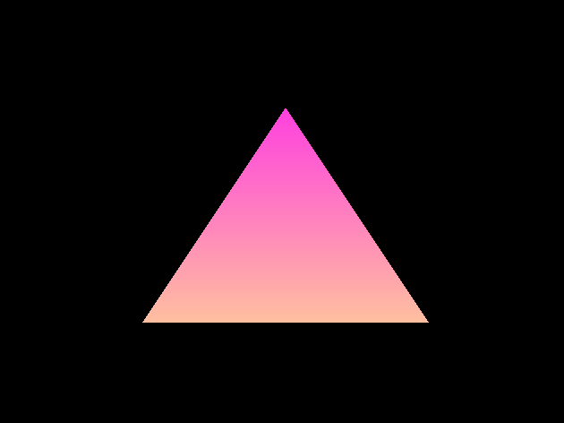

# OpenGL Study Project

## Description

This project is a personal educational endeavor, inspired by a series of instructional YouTube videos on OpenGL. It's designed to document the learning experience as I delve into the intricacies of OpenGL, demonstrating the acquired knowledge through practical application and rendering techniques.

The video series offers a structured approach to understanding OpenGL and serves as a guide for the various experiments and examples contained within this repository.

## Learning Resources

[The OpenGL video series made by The Cherno](https://youtu.be/W3gAzLwfIP0?si=prz5AUEP3mS8u6Ty)

## Build

This project uses premake for its build configuration. To generate the Visual Studio 2022 project files, run the `GenerateProjectFiles.bat` batch file included in the repository.

Future updates will include script files for building under different IDEs or operating systems.

## Screenshots

Screenshots of the graphics rendered using OpenGL will be displayed here.

